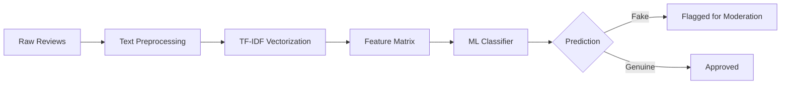
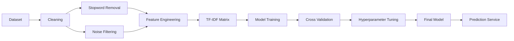
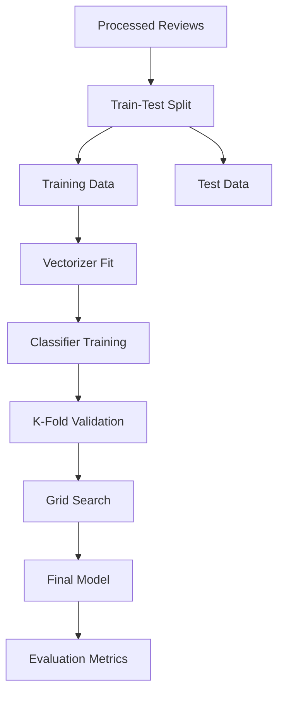
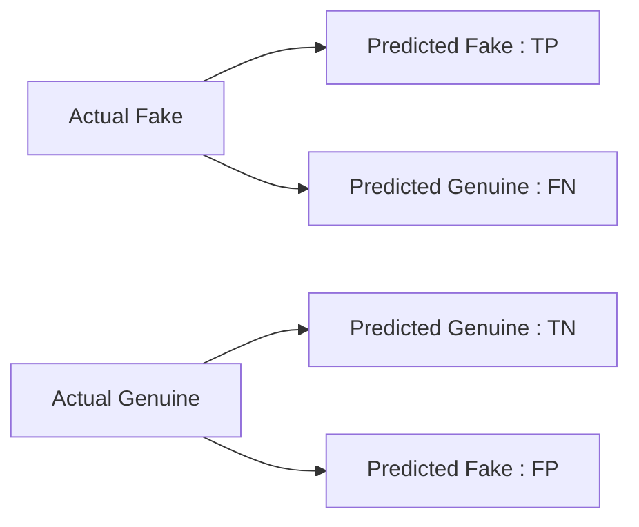
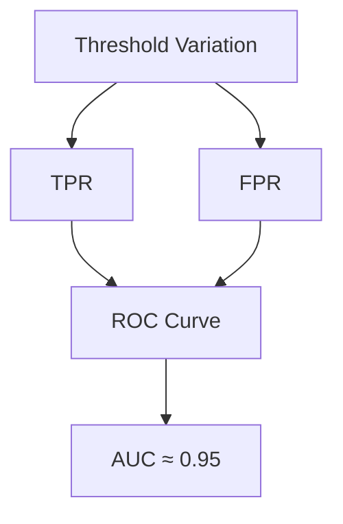
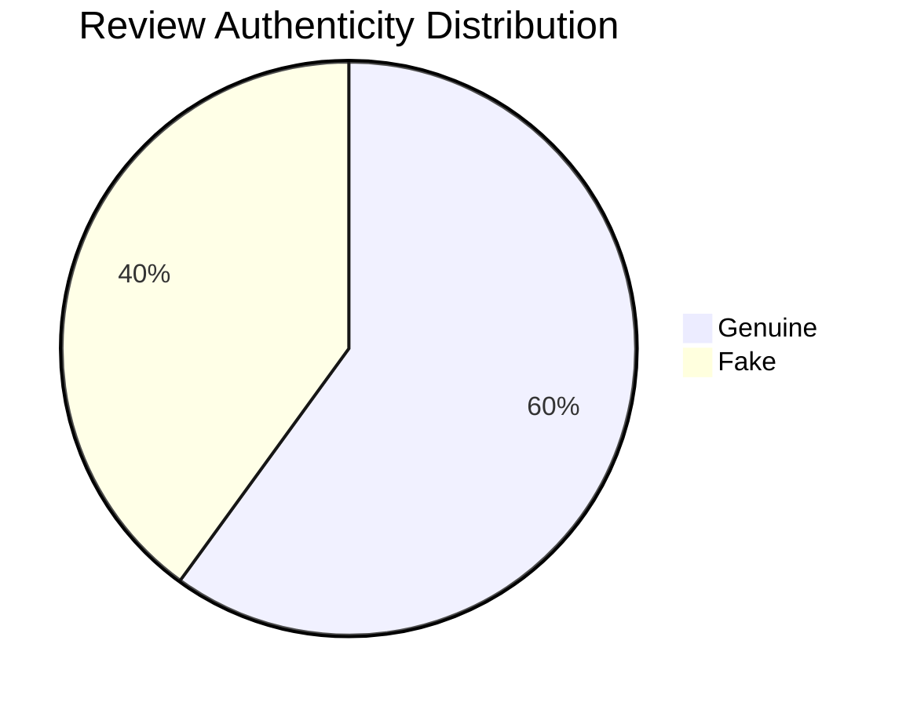
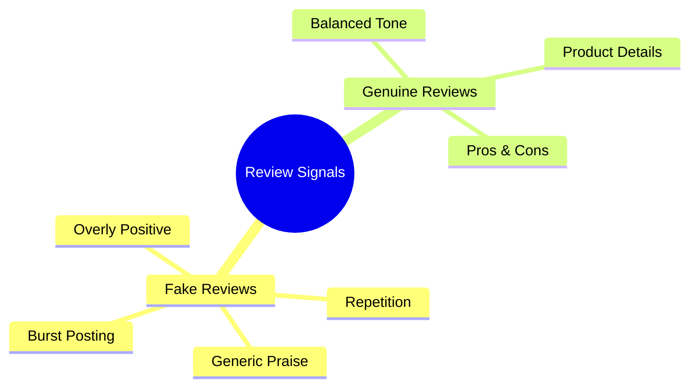

# 🛡️ ReviewGuard — Fake Review Detection System

<p align="center">


</p>

An NLP-driven **Fake Review Detection System** that classifies product and service reviews as **Genuine** or **Fraudulent** using feature-engineered linguistic signals, statistical modeling, and supervised machine learning.

Designed to emulate trust & safety moderation pipelines used by **e-commerce platforms, SaaS marketplaces, and review aggregators**.

---

# 🚀 Project Overview

Online reviews directly influence purchasing behavior, seller reputation, and platform trust. However, large-scale manipulation via bot farms, paid promotions, and coordinated campaigns undermines authenticity.

**ReviewGuard** addresses this by delivering a scalable ML pipeline that detects deceptive linguistic patterns while minimizing false accusations against legitimate users.

---

# 🎯 Problem Framing

Fake review detection is a **high-cost classification problem**:

| Error Type     | Business Impact              |
| -------------- | ---------------------------- |
| False Positive | Penalizing genuine customers |
| False Negative | Allowing fraud manipulation  |

This system prioritizes **precision–recall balance** to maintain trust integrity.

---

# ✨ Key Features

* 🧾 Real-world review corpus
* ⚖️ Balanced / semi-imbalanced classes
* 🧠 TF-IDF feature engineering
* 🤖 Supervised NLP classifier
* 🔁 K-Fold cross-validation
* 🎯 ~95% accuracy
* 📉 Controlled false accusation rate
* ⚡ Real-time inference ready
* 🧩 Modular ML pipelines
* 🏗️ Production-ready architecture

---

# 📂 Dataset Description

| Attribute     | Details                   |
| ------------- | ------------------------- |
| Domain        | Product & service reviews |
| Classes       | Genuine / Fake            |
| Data Type     | Text                      |
| Split         | 80 / 20                   |
| Feature Space | TF-IDF vectors            |

---

# 🔍 Dataset Characteristics

* Linguistic exaggeration patterns
* Sentiment inflation
* Generic praise duplication
* Burst review posting behavior

---

# 🏗️ System Architecture



---

# 🧠 End-to-End ML Pipeline



---

# 🔬 Training Workflow



---

# 🧹 Preprocessing Pipeline

* Lowercasing normalization
* Punctuation stripping
* Stopword filtering
* Token normalization
* Noise cleanup

Objective: Remove exaggeration artifacts and linguistic spam signals.

---

# 🔬 Feature Engineering

| Technique             | Purpose                    |
| --------------------- | -------------------------- |
| TF-IDF                | Token importance weighting |
| Vocabulary pruning    | Remove rare noise tokens   |
| Sparse representation | Memory efficiency          |

Captures deception signals such as:

* Over-promotion
* Repetition
* Generic sentiment bursts

---

# 🤖 Model Training & Selection

Multiple baseline models were evaluated:

| Model               | Observations             |
| ------------------- | ------------------------ |
| Naive Bayes         | Fast, strong baseline    |
| Logistic Regression | Higher interpretability  |
| Linear SVM          | Strong margin separation |

Final selection optimized for:

* Precision
* Latency
* Generalization

---

# 📊 Performance Metrics

| Metric    | Score  |
| --------- | ------ |
| Accuracy  | ~95%   |
| Precision | 93–96% |
| Recall    | 92–95% |
| F1 Score  | ~94%   |

Balanced to reduce wrongful moderation.

---

# 📊 Confusion Matrix



---

# 📈 ROC Curve



---

# 🔍 Exploratory Data Analysis

## Class Distribution



---

## Linguistic Pattern Mapping



---

# 📦 Project Structure

```
📦 ReviewGuard – Fake Review Detection System
│
├── 📁 src/                         → Core preprocessing & utility modules
│
├── 📁 data/                        → Dataset storage
│   └── 🗂️ train_reviews.csv        → Training dataset
│
├── 📁 models/                      → Saved / trained ML models
│
├── 📁 config/                      → Configuration & parameter files
│
├── 📁 templates/                   → Frontend UI (Git-ignored)
│   └── 🌐 index.html               → User input interface
│
├── 🚀 app.py                       → Application entry point
├── 🧠 train_model.py               → Model training pipeline
├── 🧪 test_api.py                  → API testing script
│
├── 📜 requirements.txt             → Python dependencies
└── 🙈 .gitignore                   → Ignored files & folders
```

---

# ⚙️ Installation

```bash
git clone https://github.com/iamlakshyamittal/ReviewGuard-Fake-Review-Detection-System.git

cd ReviewGuard-Fake-Review-Detection-System

pip install -r requirements.txt
```

---

# ▶️ Usage

### Train Model

```bash
python train_model.py
```

### Run Application

```bash
python app.py
```

---

# 🔌 API Documentation

## POST /predict

**Request**

```json
{
  "review_text": "Amazing product! Best purchase ever!"
}
```

**Response**

```json
{
  "prediction": "FAKE",
  "confidence": 0.95
}
```

---

# ⚡ Scalability & Production Readiness

* Stateless inference pipelines
* Serialized model artifacts
* API deployable
* Moderation workflow ready

Deployment options:

* Flask / FastAPI
* Marketplace moderation queues
* Trust scoring APIs

---

# 📑 Research Portfolio Summary

## Abstract

ReviewGuard presents a feature-engineered NLP system for detecting fraudulent online reviews using supervised machine learning. The model achieves ~95% accuracy while maintaining precision-recall balance critical for trust moderation systems.

---

## Limitations

* Context understanding limited to lexical signals
* No reviewer behavioral graph modeling
* English-only dataset

---

# 🔮 Future Enhancements

* Transformer deception detection
* Reviewer network fraud graphs
* Multilingual detection
* Real-time streaming moderation

---

# 🤝 Contributing

Fork → Branch → Commit → PR

